<!-- Generated by tools/make_readme.py from tools/README.template.md: edit the template, then run the script. -->
# Sakura Planter

A printed hexagonal planter, trunk and branches that turn **LEGO 10280 Flower Bouquet** and **LEGO 40725 Cherry Blossoms** into one arrangement: the bouquet grows out of a black TPU "soil", and the cherry blossoms sit on a bone-white tree. A recessed sakura branch wraps the planter, ready to fill with acrylic paint.

Designed in FreeCAD for the **Prusa CORE One** (0.4 mm HF nozzle) in **eSUN PLA+ Bone White**, **TPU 95A black** and **TPU 95A clear**.

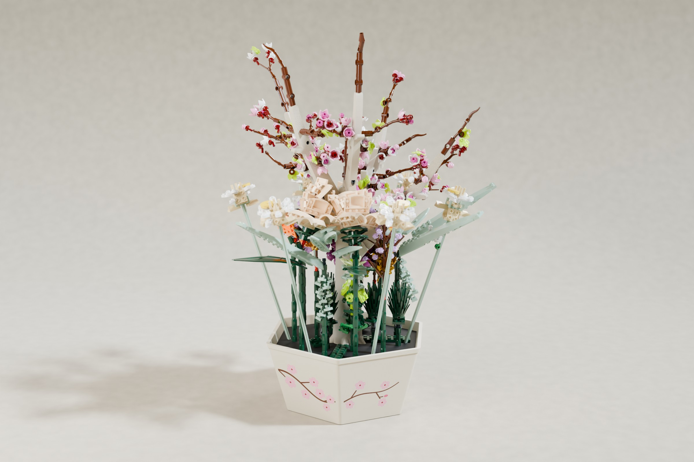

**[Open the 3D assembly guide →](https://sawaiz.github.io/sakuraPlanter/)** Turn the model and step through the build. The page lives in [`docs/`](docs/).

| | |
|---|---|
| LEGO pieces | 1,193 of 1,194 from the two sets (the brick separator is a tool) |
| Printed parts | 20: planter, soil core, soil mat, trunk, 5 branches, 6 feet, 5 joint sleeves |
| Fit-test kit | 7 pieces that copy each joint, in 7 sizes each |
| Plates | 9 on the CORE One bed (3 fit-test, 6 for the model) |
| Print time | ≈ 27 h for the model, ≈ 31 h with the fit-test kit |
| Filament | ≈ 614 g bone PLA, ≈ 69 g black TPU, ≈ 11 g clear TPU |
| Finished size | ≈ 33 × 32 cm, 49 cm tall; planter 227 mm across corners, 198 mm across flats |

## Contents

1. [What you need](#what-you-need)
2. [Files in this repository](#files-in-this-repository)
3. [Printing](#printing)
4. [Fit-test kit: tune the fits before the big prints](#fit-test-kit)
5. [Assembly](#assembly)
6. [Design notes](#design-notes)
7. [Changing the design and rebuilding everything](#changing-the-design)
8. [The 3D assembly page](#the-3d-assembly-page)
9. [Credits and licences](#credits-and-licences)

## What you need

- LEGO **10280 Flower Bouquet** and **40725 Cherry Blossoms**. [`lego/parts_inventory.xlsx`](lego/parts_inventory.xlsx) lists every piece in the two sets; [`lego/parts_usage.csv`](lego/parts_usage.csv) says what each one does here and in which step.
- A **Prusa CORE One** with the stock 0.4 mm high-flow nozzle and a **textured PEI sheet**.
- **eSUN PLA+ Bone White**: one 1 kg spool is plenty (≈ 614 g).
- **TPU 95A**: ≈ 69 g black and ≈ 11 g clear.
- **PrusaSlicer 2.9 or newer** (it has the CORE One profiles), and a filament dryer for the TPU.
- **Acrylic paint** in four colours (suggested: burnt umber, a soft pink, crimson, rose), a fine brush, a lint-free cloth and optionally matte acrylic varnish.
- Flush cutters, a spare LEGO axle and Technic pin to clear holes, and long tweezers for the floor sockets.

## Files in this repository

| Folder | What's in it |
|---|---|
| [`print/plates/`](print/plates/) | **Start here for printing.** Nine PrusaSlicer project files (3MF), one per plate, with the parts arranged and every setting already applied. |
| [`print/stl/`](print/stl/) | Each part as an STL, in print orientation. |
| [`cad/`](cad/) | `SakuraPlanter.FCStd` (FreeCAD 1.0) and `build_sakura.FCMacro`, the parametric macro that builds every part from the **Params** spreadsheet; `motif.json` (the sakura artwork); STEP and STL exports in `cad/out/`. |
| [`lego/`](lego/) | `sakura_planter.mpd`, the complete model with the printed parts (opens in BrickLink Studio, LeoCAD, LDView); piece placements, step lists and the fit-check report. |
| [`docs/`](docs/) | The 3D assembly page (three.js, no build step). |
| [`images/`](images/) | Renders used in this README. |
| [`tools/`](tools/) | Scripts: motif generator, plate builder, slicer runner, README generator, renders. |
| [`pipeline/`](pipeline/) | Scripts that place all 1,193 LEGO pieces on the printed parts and check the build. |

## Printing

### Materials and drying

| Filament | Parts | Nozzle / bed | Dry before printing |
|---|---|---|---|
| eSUN PLA+ Bone White | planter, soil core, trunk, branches, PLA fit tests | 220 °C (225 °C first layer) / 60 °C | 50 °C for 4–6 h if the spool has been open a while |
| TPU 95A black | soil mat, black fit test | 230 °C / 55 °C | always: 50–55 °C for 4–6 h |
| TPU 95A clear | feet, joint sleeves, clear fit test | 235 °C / 55 °C | always: 50–55 °C for 4–6 h |

Wet TPU strings and pops, and clear TPU turns cloudy. The temperatures sit inside eSUN's published ranges (PLA+ 205–230 °C, eTPU-95A 220–250 °C); if your TPU is another brand, check its datasheet.

### Printer and slicer

- **Open the 3MF files in PrusaSlicer.** Each one carries the CORE One HF0.4 printer profile, the *0.20mm BALANCED @COREONE HF0.4* print profile and a filament profile, with this project's changes applied (table below). When PrusaSlicer asks, load the project's settings.
- **Supports: none** on every plate. Nothing in this design needs them.
- **Sheet:** textured PEI throughout. TPU bonds very hard to smooth PEI, so if you use smooth PEI, wipe on glue stick as a release layer.
- **Chamber:** keep it cool for PLA and TPU. Current CORE One firmware opens the top vent by itself for these materials; with older firmware, open it by hand.
- **Standard (non-HF) nozzle?** Switch the printer to *Original Prusa CORE One 0.4 nozzle* and the print profile to *0.20mm BALANCED @COREONE 0.4*; keep the other settings.

### The plates

Print the fit-test plates (01–03) first, tune if needed (next section), then the rest in any order.

| Plate | Parts | Material | Time | Filament | Settings that differ from the preset |
|---|---|---|---|---|---|
| [01](print/plates/01_fit-kit-pla.3mf) | Fit-test kit, PLA (FT1-FT5) | eSUN PLA+ Bone White | 2 h 43 min | 60 g | 3 perimeters, 25% gyroid |
| [02](print/plates/02_fit-kit-tpu-black.3mf) | Fit-test kit, black TPU (FT6) | TPU 95A Black | 35 min | 6 g | 3 perimeters, 100% rectilinear |
| [03](print/plates/03_fit-kit-tpu-clear.3mf) | Fit-test kit, clear TPU (FT7) | TPU 95A Clear | 30 min | 6 g | 3 perimeters, 100% rectilinear |
| [04](print/plates/04_planter.3mf) | Planter | eSUN PLA+ Bone White | 7 h 12 min | 250 g | 3 perimeters, 15% gyroid |
| [05](print/plates/05_trunk.3mf) | Trunk | eSUN PLA+ Bone White | 7 h 32 min | 132 g | 4 perimeters, 25% gyroid, 5 mm brim, fuzzy skin (joints kept smooth) |
| [06](print/plates/06_branches.3mf) | Branches 1-5 | eSUN PLA+ Bone White | 3 h 56 min | 83 g | 4 perimeters, 25% gyroid, fuzzy skin (joints kept smooth) |
| [07](print/plates/07_soil-core.3mf) | Soil core | eSUN PLA+ Bone White | 3 h 01 min | 89 g | 2 perimeters, 15% gyroid |
| [08](print/plates/08_soil-mat.3mf) | Soil mat | TPU 95A Black | 5 h 20 min | 63 g | 3 perimeters, 100% rectilinear |
| [09](print/plates/09_feet-and-sleeves.3mf) | Feet x6 and joint sleeves x5 | TPU 95A Clear | 29 min | 5 g | 3 perimeters, 100% rectilinear |

Times and weights come from slicing each plate with the PrusaSlicer command line (PrusaSlicer-2.7.2) using the CORE One HF0.4 profiles. They leave out the start sequence (homing, bed levelling, purge: about 3 minutes), and newer PrusaSlicer releases may estimate a little differently. Slice before you print to see your own numbers.

<table>
<tr><td align="center">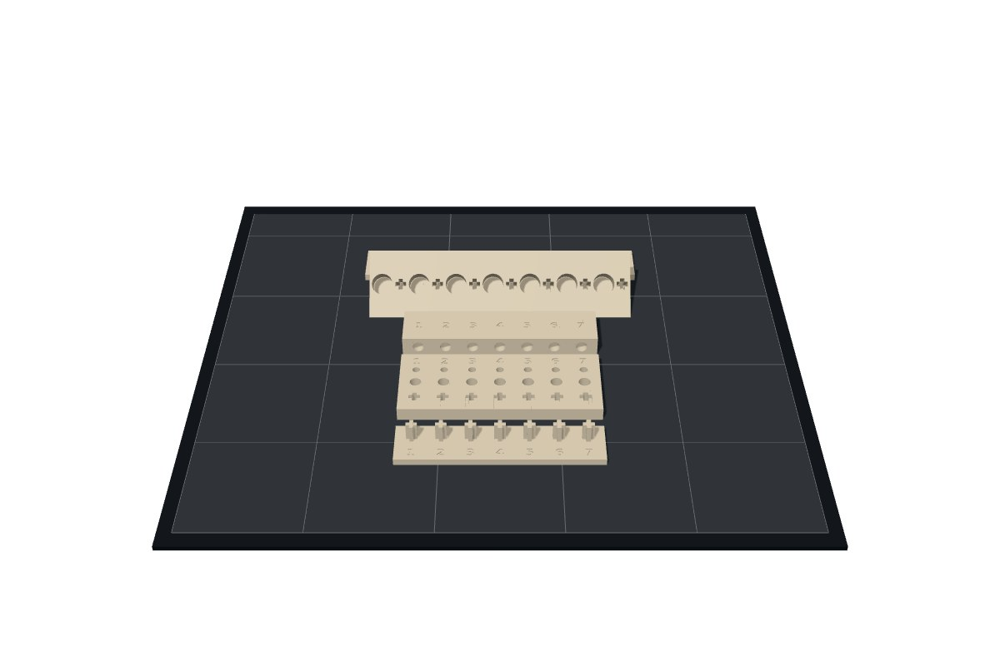<br><sub>01: Fit-test kit, PLA (FT1-FT5)</sub></td><td align="center">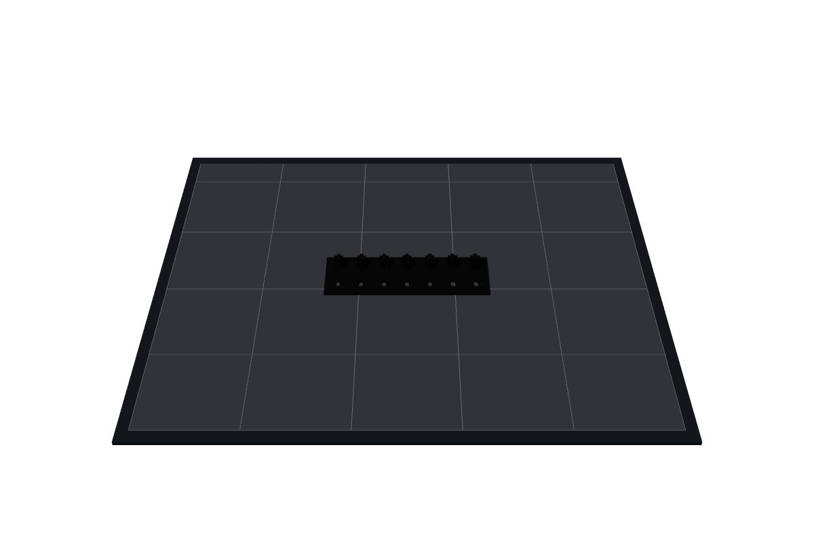<br><sub>02: Fit-test kit, black TPU (FT6)</sub></td><td align="center">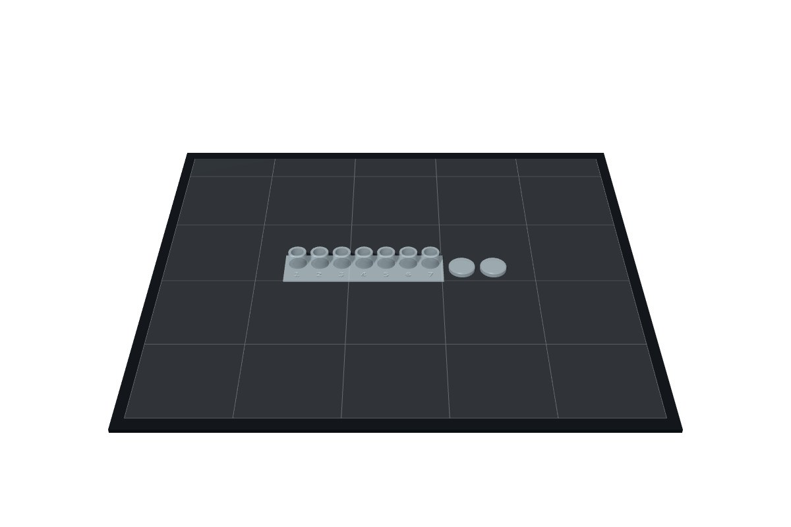<br><sub>03: Fit-test kit, clear TPU (FT7)</sub></td></tr>
<tr><td align="center">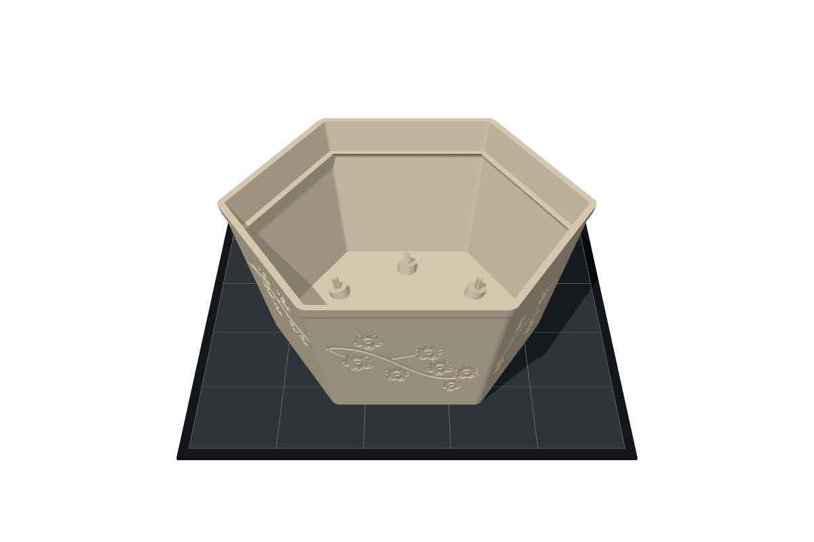<br><sub>04: Planter</sub></td><td align="center">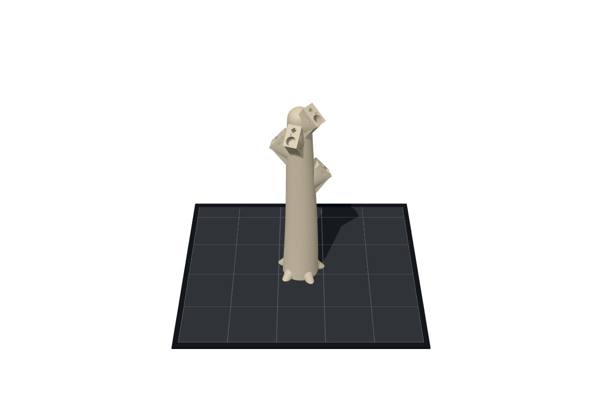<br><sub>05: Trunk</sub></td><td align="center">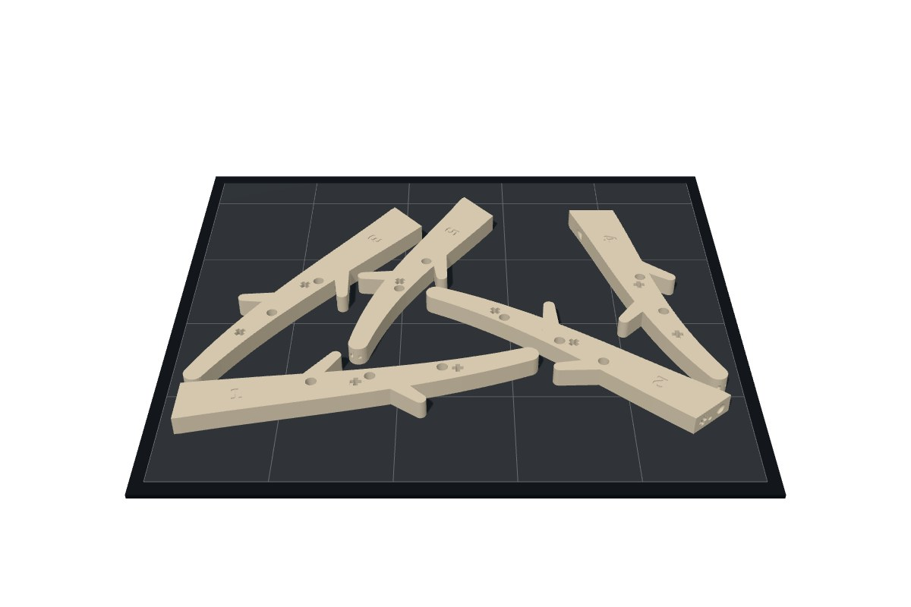<br><sub>06: Branches 1-5</sub></td></tr>
<tr><td align="center">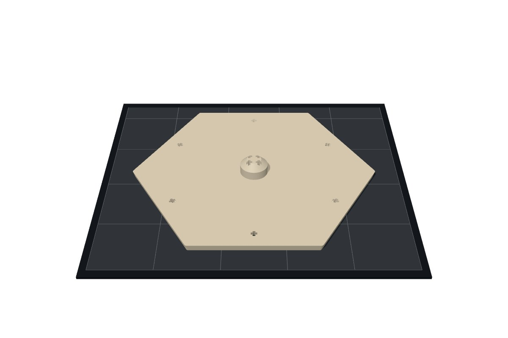<br><sub>07: Soil core</sub></td><td align="center">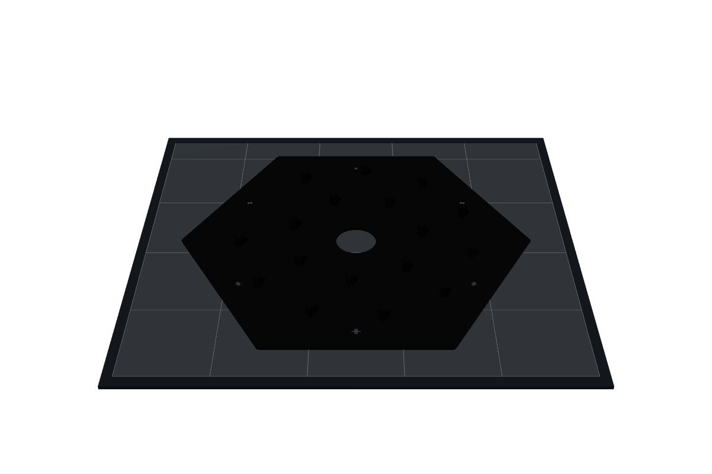<br><sub>08: Soil mat</sub></td><td align="center">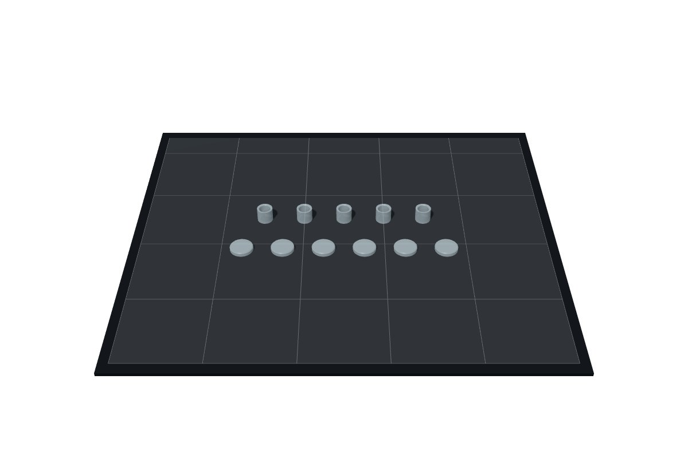<br><sub>09: Feet x6 and joint sleeves x5</sub></td></tr>
</table>

**Notes per plate**

- **Planter (04).** Prints upright. The six foot pockets underneath are short bridges, and the motif pockets are cut inward and downward at 45°, so their top edges print as slopes rather than ledges. Paint the seam onto a hex corner with the seam-painting tool if you want it out of sight.
- **Trunk (05).** The tallest print, 219 mm (the CORE One allows 270 mm), on a 5 mm brim. The branch stubs sit on 45° collars and their holes are angled, so no supports are needed. PrusaSlicer may flag "floating bridge anchors": those are the short bridges over the angled stub holes and they print fine.
- **Trunk and branches (05, 06): fuzzy skin bark.** Fuzzy skin is set to *outside walls only* on these objects, and each object carries modifier volumes that switch it off around every joint: the stub faces, sleeve pockets, key pins and numbers, the branch roots and tips. Holes stay true and joints seat flat. (Checked on the sliced G-code: wall segments inside the modifiers are identical to a print without fuzzy skin.)
- **Branches (06).** All five nest on one plate, at least 7 mm from every edge. The cross holes that run sideways through each branch print as short bridges.
- **Soil core (07) and soil mat (08).** The soil is split: a fast bone PLA core carries the trunk on its raised boss, and a 1.6 mm black TPU mat on top carries the 17 stem pegs. The mat is printed solid so the pegs grip.
- **Feet and sleeves (09).** Small TPU parts: print slowly and keep the TPU dry. Clear TPU comes out frosted, not glassy.

### After printing

- Remove the trunk brim and deburr the bottom edge of every part.
- Run a LEGO axle through every cross hole and push a Technic pin into every round hole; a 5 mm drill bit turned by hand clears a tight one.
- Each branch has its number engraved near the root and each trunk stub carries the same number on both sides.
- Snip TPU stringing once it's cool; don't sand TPU.

<a id="fit-test-kit"></a>
## Fit-test kit: tune the fits before the big prints

Hole sizes that fit LEGO depend on your printer, nozzle and spool. The kit copies each joint the way it is really printed (orientation, wall, material) and repeats it in **seven sizes**. Every cell has its number engraved next to it:

| Cell | 1 | 2 | 3 | 4 | 5 | 6 | 7 |
|---|---:|---:|---:|---:|---:|---:|---:|
| Size change (mm) | −0.15 | −0.10 | −0.05 | **0** | +0.05 | +0.10 | +0.15 |

Cell 4 is the design as supplied. Test each row with the real LEGO piece:

| Piece | Material | What it copies | Parameter(s) | A good fit |
|---|---|---|---|---|
| FT1 Floor pegs | PLA | cross pegs standing on a plate, like the planter floor | `peg_w`, `peg_t` | a dark green 3L connector pushes on and stays on upside down |
| FT2 Vertical holes, row 1 | PLA | cross holes | `axle_w`, `axle_t` | a LEGO axle slides in with light friction and does not fall out |
| FT2 Vertical holes, row 2 | PLA | round pin holes | `pin_d` | a black friction pin pushes in firmly and turns stiffly |
| FT2 Vertical holes, row 3 | PLA | small round holes (not used by the current parts; there for remixes) | `bar_d` | a 3.18 mm LEGO bar pushes in and holds |
| FT3 Branch root, front | PLA | pin holes printed sideways, like the branch roots | `hpin_d` | a 3L pin's 2L end pushes in firmly |
| FT3 Branch root, back | PLA | cross holes printed sideways | `haxle_w`, `haxle_t` | a 2L axle pushes in with light friction |
| FT4 Stub face | PLA | sleeve pockets and cross holes on a 45° face, like the trunk stubs | `sleeve_pocket_d` (pockets), `axle_w`, `axle_t` (holes) | a clear sleeve presses in with your thumb and stays; an axle slides in |
| FT5 Foot pockets | PLA | pockets on the underside, like the planter | `foot_pocket_d` | a clear foot presses in and stays |
| FT6 Soil mat | black TPU | stem pegs and axle pass-throughs at mat thickness | `tpu_peg_w`, `tpu_peg_t` (pegs), `tpu_axle_w`, `tpu_axle_t` (holes) | a 3L connector pushes on and has to be pulled off; a 32L axle slides through and stays where you leave it |
| FT7 Sleeves | clear TPU | seven sleeves on a numbered web, plus two feet | `sleeve_id` | the stop bush of a 3L pin pushes in and the pin can't wobble |

<p>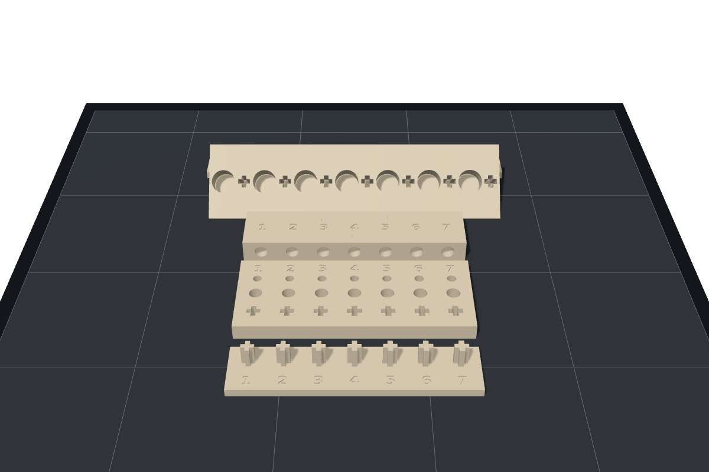 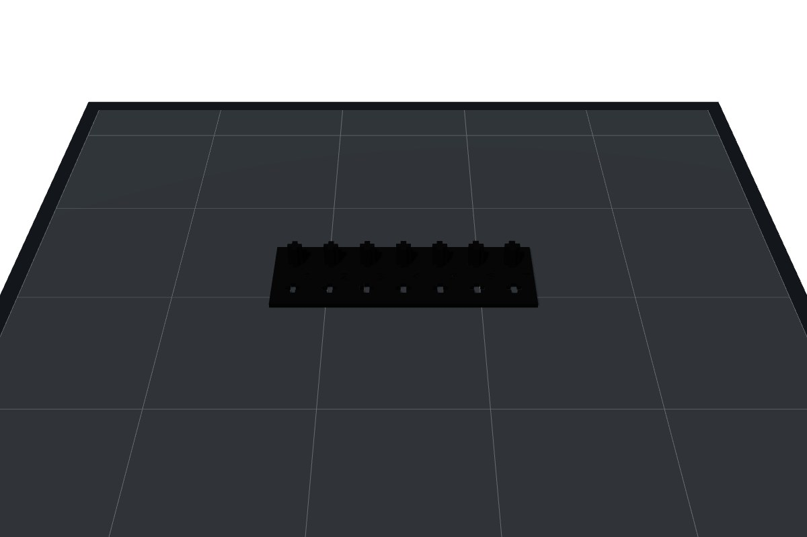 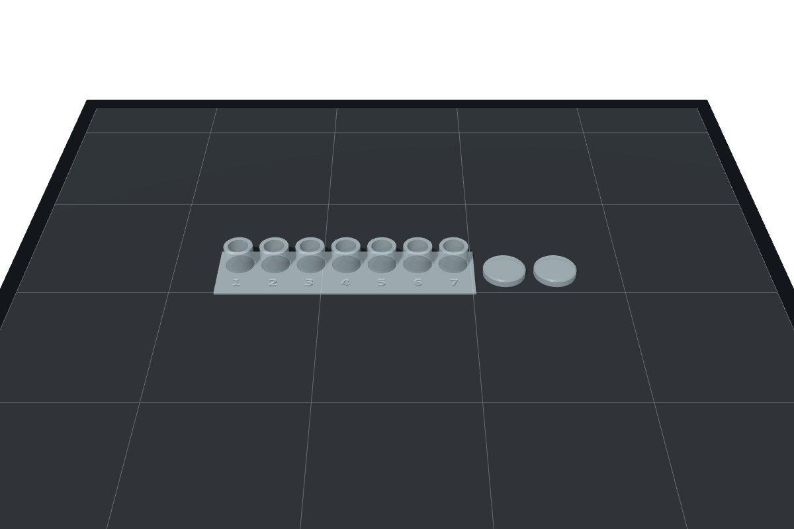</p>

**If cell 4 fits everywhere, print the model as supplied.** Otherwise:

1. Note the best cell for each row and look up its size change. For a cross hole or peg, apply the same change to both values (for example cell 5 on FT2 row 1: `axle_w` 5.0 → 5.05 and `axle_t` 2.0 → 2.05).
2. Open `cad/SakuraPlanter.FCStd` in FreeCAD 1.0, edit the values in the **Params** sheet (column B) and save.
3. Run the macro: **Macro ▸ Macros… ▸ `build_sakura.FCMacro` ▸ Execute** (keep the macro, `motif.json` and `fonts/` together in `cad/`). It rebuilds every part and writes new STL and STEP files to `cad/out/`.
4. Rebuild the plates: `python tools/make_plates.py path/to/PrusaResearch.ini`. The `.ini` is PrusaSlicer's vendor profile bundle, found in PrusaSlicer's `resources/profiles/` folder. Without it you get 3MFs with the parts and per-object settings only, and you pick the presets yourself.

If FT2 and FT4 disagree about the cross hole (vertical against angled), use the value between them.

## Assembly

The same steps, in 3D with every piece animating into place, are on the **[assembly page](https://sawaiz.github.io/sakuraPlanter/)**. Sort the LEGO pieces by step first: the lists below are exact.

### Prep A: Paint the sakura motif

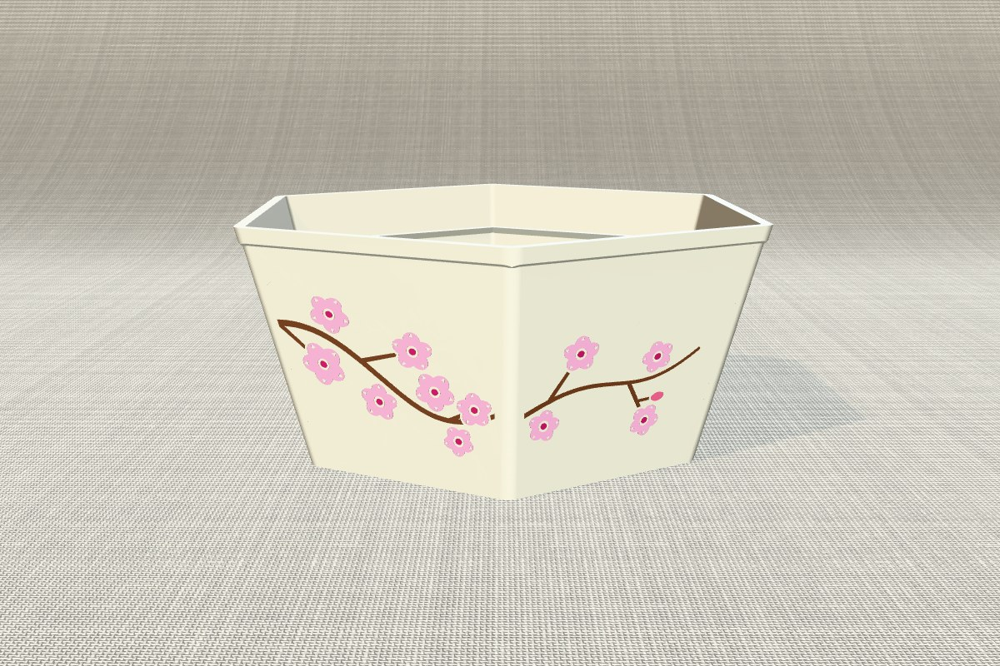

The branch that wraps the planter is recessed 0.8 mm, with a separate pocket for each colour: bark, petals, flower centres and buds. Each pocket is at least 1.1 mm wide and every colour is separated by a 0.9 mm land, so you can flood a pocket and wipe the surface clean.

Work one colour at a time: brush acrylic into the pockets a little proud of the surface, wait 2–3 minutes, then wipe across the face with a slightly damp lint-free cloth or a card scraper. Let each colour dry before the next.

- Suggested colours: burnt umber for the bark, a soft pink (white + a touch of magenta) for petals, crimson for the centres, rose for the buds.
- Paint before fitting the feet, so the planter can sit flat on its rim while it dries.
- Any paint left in the layer lines comes off with 1000-grit wet paper used dry, or a melamine sponge.
- A coat of matte acrylic varnish evens out the sheen between paint and PLA.

### Prep B: Fit the feet

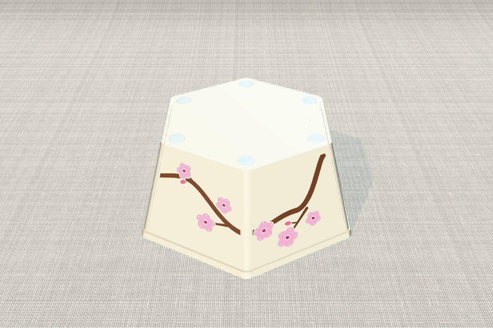

Turn the planter over and press a clear TPU foot into each of the six round pockets underneath. They are a 0.3 mm press fit and stand 0.8 mm proud, so the planter rests on rubber, not PLA.

- If a foot is loose, a drop of flexible CA glue holds it; if it won't go in, roll its edge between your fingers first.

### Prep C: Fit the joint sleeves

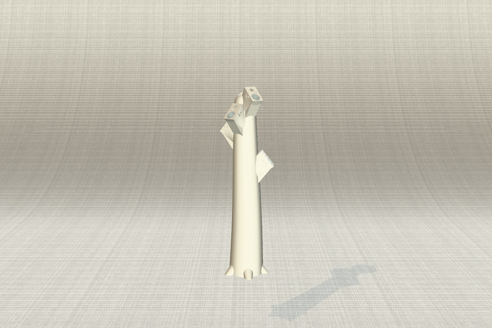

Press a clear TPU sleeve into the round pocket on the face of each of the five trunk stubs until it bottoms out, 0.4 mm below the face. The flat end of a pen works well.

Each sleeve will grip the stop bush of a black 3L pin, which is what holds each branch at its angle.

- Every stub carries its number (1–5) on both sides, and a small key pin on its face: only the branch with the same number fits it.

### Step 1. Floor sockets and long axles

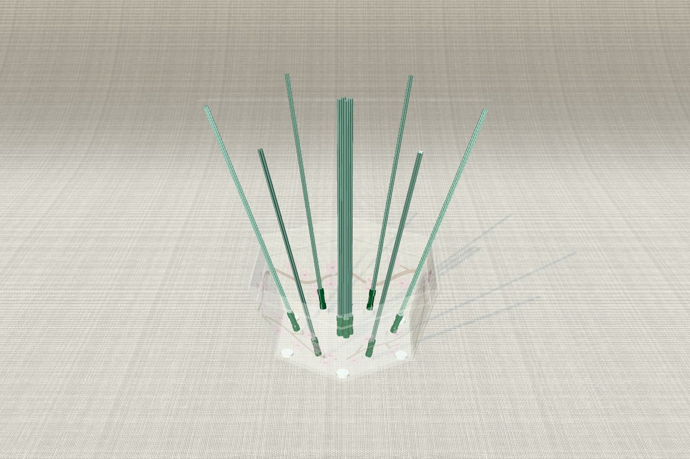

Stand a dark green 3L connector on each of the ten printed cross pegs on the planter floor. Push a sand green 32L axle 8 mm into the top of each one: the four centre axles stand straight, the six daisy axles lean outward on their angled bosses.

- The planter is shown see-through. Long tweezers help reach the floor pegs.

<details><summary>LEGO pieces for this step (20)</summary>

| Qty | Colour | Part | ID |
|---:|---|---|---|
| 10 | Dark Green | Technic, Axle Connector 3L | `26287` |
| 10 | Sand Green | Technic, Axle 32L | `50450` |

</details>

### Step 2. Soil core and mat

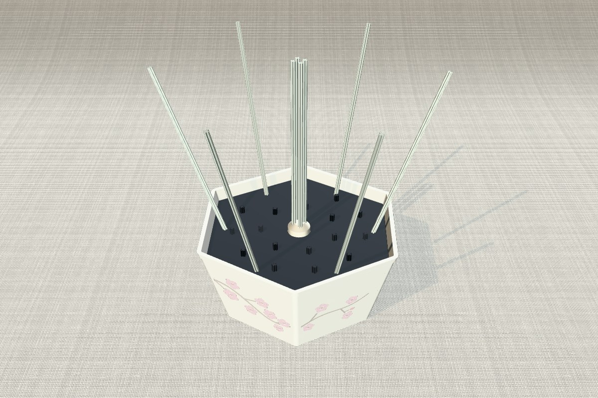

Thread the bone PLA soil core over all ten axles and lower it onto the ledge inside the planter; the raised boss goes in the middle. Then thread the black TPU mat over the same axles, pegs up, and press it down onto the core so it sits around the boss.

The mat's pass-throughs grip the axles lightly, which keeps the six daisy axles at their angle.

- If the mat lifts when you later pull a stem off its peg, hold the mat down with a finger beside the peg.

### Step 3. Trunk

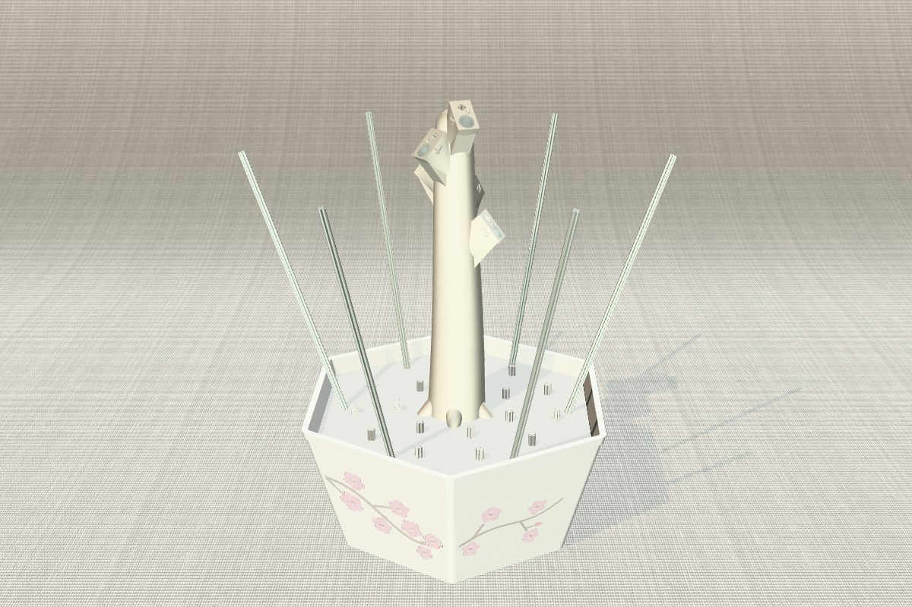

Lower the trunk over the four centre axles. They run up the four channels in its core, and the trunk settles onto the PLA boss.

- Turn the trunk until its lowest stub (number 1) points the way you want the planter's front to face.

### Step 4. Branches

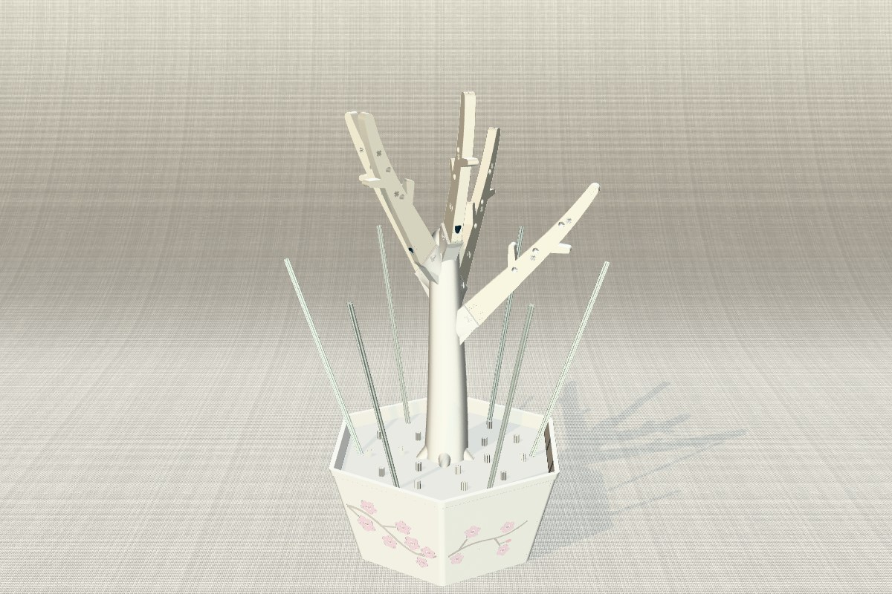

For each branch: push the 2L end of a black 3L pin (the end without the bush) into the round hole in the branch root, and a black 2L axle into the cross hole next to it. Then press the pin's bush into the clear sleeve on the stub with the same number while the axle enters the stub's cross hole.

The branch is seated when its root face sits flat against the stub face.

- If a branch won't sit flat, it's on the wrong stub or upside down: the engraved number on the branch faces the same way as the number on the stub.

<details><summary>LEGO pieces for this step (10)</summary>

| Qty | Colour | Part | ID |
|---:|---|---|---|
| 5 | Black | Technic, Pin 3L with Friction Ridges and Stop Bush | `32054` |
| 5 | Black | Technic, Axle 2L Notched | `32062` |

</details>

### Step 5. Flower stems

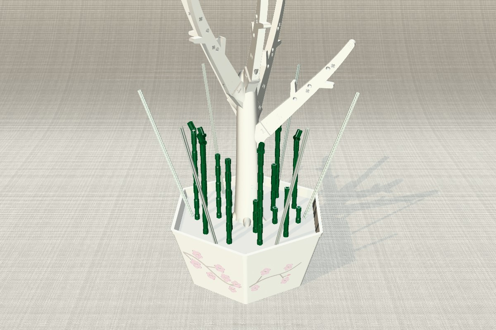

Build the 17 stems on the mat's TPU pegs: dark green 3L connectors joined by hidden red 2L axles. Seven outer stems get an angled connector near the top so their heads lean out.

- Push each first connector straight down until it touches the mat; the TPU peg grips it.

<details><summary>LEGO pieces for this step (107)</summary>

| Qty | Colour | Part | ID |
|---:|---|---|---|
| 55 | Dark Green | Technic, Axle Connector 3L | `26287` |
| 45 | Red | Technic, Axle 2L Notched | `32062` |
| 7 | Dark Green | Technic, Axle and Pin Connector Angled #3 - 157.5 degrees | `32016` |

</details>

### Step 6. Roses, aster and ground cover

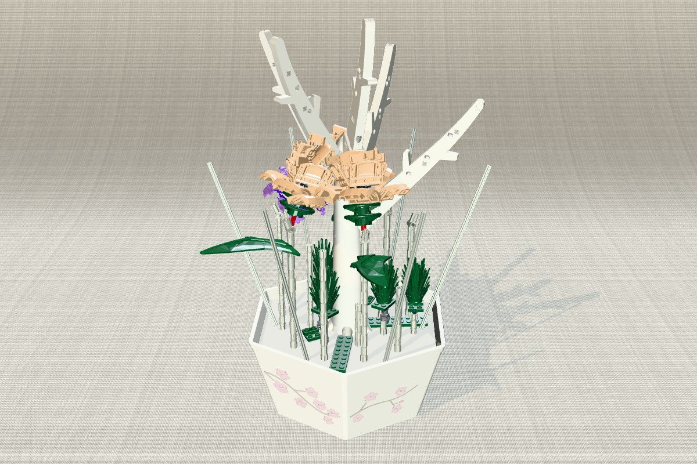

Add the three peach roses (each with a pteranodon-wing leaf), the lavender aster dome and the four prickly bushes. Lay the dark green plates on the soil in the gaps between the two rings of stems.

- Fan the petals out a little as you build each head: some petals in the rose, poppy, snapdragon and aster heads sit in each other's space as modelled and need to flex aside.

<details><summary>LEGO pieces for this step (164)</summary>

| Qty | Colour | Part | ID |
|---:|---|---|---|
| 34 | Medium Lavender | Plant Plate, Round 1 x 1 with 3 Layered Leaves | `32607` |
| 24 | Light Nougat | Plate, Modified 1 x 2 with Clip on Side | `11476` |
| 20 | Dark Purple | Plate, Modified 1 x 1 with Open O Clip | `61252` |
| 12 | Light Nougat | Vehicle, Mudguard 3 x 4 x 1 2/3 Curved Front | `98835` |
| 12 | Light Nougat | Wedge 3 x 4 x 2/3 Triple Curved | `93604` |
| 12 | Light Nougat | Tile 1 x 2 | `3069` |
| 7 | Dark Green | Vehicle, Steering Wheel with 2 x 2 Center and Axle Hole | `67811` |
| 6 | Black | Technic, Pin Connector Round with 4 Clips | `90202` |
| 5 | Red | Technic, Axle 2L Notched | `32062` |
| 4 | Black | Brick, Round 1 x 1 | `3062` |
| 4 | Dark Bluish Gray | Technic, Axle Connector with Axle Hole | `32039` |
| 4 | Dark Green | Plant Prickly Bush 2 x 2 x 4 | `6064` |
| 3 | Dark Green | Dinosaur Wing Pteranodon - Left with Marbled Sand Green Edge | `98088pb05` |
| 3 | Dark Green | Plate 2 x 3 | `3021` |
| 3 | Black | Technic, Axle 2L Notched | `32062` |
| 3 | Dark Green | Slope, Curved 2 x 2 x 2/3 Inverted | `32803` |
| 3 | Dark Green | Plate 2 x 8 | `3034` |
| 2 | Black | Technic, Axle and Pin Connector Hub with 2 Perpendicular Axles | `10197` |
| 2 | Black | Cylinder Half 1 x 2 x 1 | `68013` |
| 1 | Dark Purple | Tile, Round 2 x 2 with Open Stud | `18674` |

</details>

### Step 7. Poppies, lavender, snapdragons and foliage

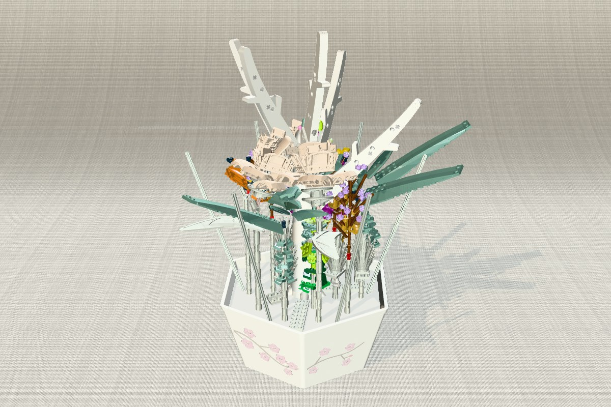

Add the two orange poppies, the three lavender spikes, the two pink snapdragon spikes and the two sprays of big sand green leaves.

- On the snapdragon nearest the trunk, turn the lowest blossom whorl away from the trunk; it touches otherwise.

<details><summary>LEGO pieces for this step (342)</summary>

| Qty | Colour | Part | ID |
|---:|---|---|---|
| 55 | Lavender | Plate, Round 1 x 1 with Flower Edge (5 Petals) | `24866` |
| 32 | Sand Green | Tile, Modified 1 x 1 with Open O Clip | `15712` |
| 18 | Reddish Brown | Plant Flower Stem with Bar Holder, Bar, and 3 Stems | `24855` |
| 16 | Magenta | Plant Leaves 2 x 2 with 4 Petals and Axle Hole | `15469` |
| 16 | Magenta | Brick, Round 2 x 2 Dome Top | `553` |
| 16 | Dark Pink | Cone 2 x 2 Truncated | `98100` |
| 16 | Bright Pink | Cone 1 x 1 with Top Groove | `4589b` |
| 12 | Reddish Brown | Bar 4L | `30374` |
| 9 | Pearl Gold | Minifigure, Headgear Crown Eggshell with 5 Points | `39262` |
| 9 | Pearl Gold | Plant Plate, Round 1 x 1 with 3 Layered Leaves | `32607` |
| 8 | Black | Bar Holder with Handle | `23443` |
| 8 | Lime | Brick, Round 1 x 1 | `3062` |
| 8 | Yellowish Green | Plate, Modified 1 x 1 with Tooth Horizontal | `49668` |
| 7 | Red | Technic, Axle 2L Notched | `32062` |
| 7 | Sand Green | Plate, Modified 2 x 2 with Bar Frame Octagonal | `75937` |
| 6 | Reddish Brown | Bar 6L with Stop Ring | `63965` |
| 6 | Dark Green | Plate, Modified 1 x 2 with 1 Stud with Groove and Bottom Stud Holder | `15573` |
| 6 | Dark Green | Plate, Round 1 x 1 with Open Stud | `85861` |
| 6 | Lime | Plate 2 x 2 | `3022` |
| 4 | Orange | Wedge 3 x 4 x 2/3 Triple Curved | `93604` |
| 4 | Orange | Slope, Curved 3 x 1 | `50950` |
| 4 | Orange | Plate, Modified 1 x 2 with Bar Handle on Side - Free Ends | `2540` |
| 4 | Black | Plate, Modified 1 x 2 with Bar Handle on End | `60478` |
| 4 | Yellow | Bar Holder with Clip | `11090` |
| 4 | Yellow | Plate, Modified 1 x 2 with Clip on Side | `11476` |
| 4 | Pearl Gold | Tile, Round 1 x 1 with Bar and Small Pin Hole | `20482` |
| 4 | Reddish Brown | Tile, Modified 1 x 1 with Open O Clip | `15712` |
| 4 | Green | Brick, Round 2 x 2 with Axle Hole | `3941` |
| 4 | Sand Green | Hero Factory Weapon, Claw Wide Curved | `15362` |
| 3 | Black | Plate, Modified 2 x 2 with Pin Holes | `2817` |
| 3 | Green | Plate, Modified 1 x 2 with 2 Open O Clips | `60470b` |
| 3 | Green | Plate, Modified 1 x 2 with Bar Handle on Side - Closed Ends | `48336` |
| 3 | Green | Plate, Round 2 x 2 with Axle Hole | `4032` |
| 3 | Lime | Brick, Modified 1 x 1 with Studs on 4 Sides | `4733` |
| 3 | Sand Green | Wedge 16 x 4 Triple Curved with Reinforcements | `45301` |
| 3 | Sand Green | Minifigure, Utensil Surfboard Standard | `90397` |
| 3 | Sand Green | Slope, Curved 2 x 2 x 2/3 | `15068` |
| 3 | Sand Green | Wedge 4 x 3 Triple Curved No Studs | `64225` |
| 2 | Yellow | Brick, Modified 1 x 2 x 1 2/3 with Studs on Side and Ends | `67329` |
| 2 | Orange | Wedge 4 x 3 Triple Curved No Studs | `64225` |
| 2 | Lime | Technic, Axle Connector 2L | `6538c` |
| 2 | Sand Green | Cone 1 x 1 with Top Groove | `4589b` |
| 2 | Dark Green | Plate, Round 2 x 2 with Axle Hole | `4032` |
| 2 | Black | Technic, Axle 2L Notched | `32062` |
| 1 | Yellow | Plate 2 x 2 | `3022` |
| 1 | Black | Technic, Pin 3L with Friction Ridges and Stop Bush | `32054` |

</details>

### Step 8. Daisies

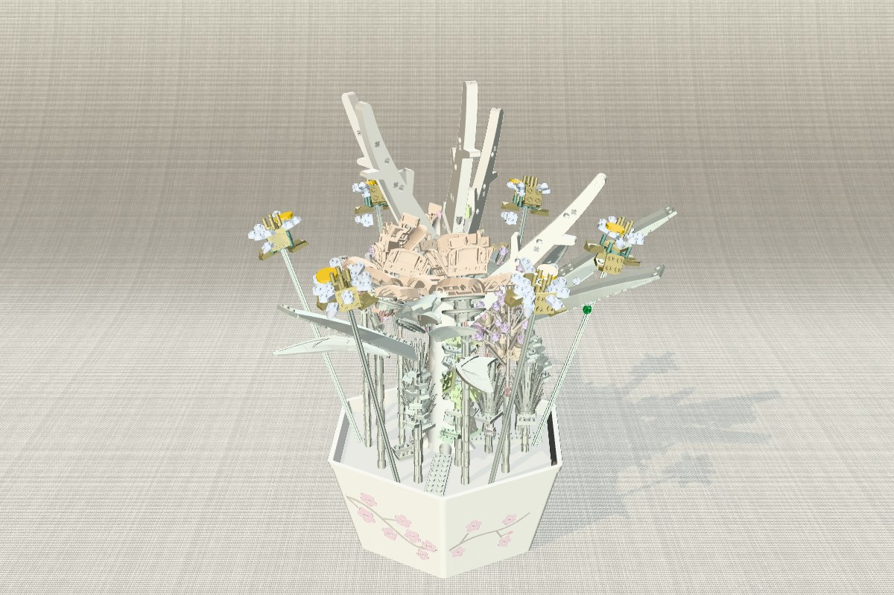

Build the six daisy heads on the tops of the six leaning sand green 32L axles.


<details><summary>LEGO pieces for this step (111)</summary>

| Qty | Colour | Part | ID |
|---:|---|---|---|
| 48 | White | Plate, Round 1 x 2 with Open Studs | `35480` |
| 12 | Tan | Bracket 1 x 2 - 2 x 2 Inverted | `99207` |
| 12 | White | Plate, Modified 1 x 1 with Tooth Horizontal | `49668` |
| 12 | Tan | Slope, Curved 1 x 2 x 2/3 Wing End | `47458` |
| 6 | Tan | Bar 1.2L with Top Stud and 4 Bar Arms Up | `2566` |
| 6 | Yellow | Tile, Round 2 x 2 with Bottom Stud Holder | `14769` |
| 4 | Sand Green | Plate, Round 2 x 2 with Pin Hole and 4 Bar Arms Up | `98284` |
| 3 | Tan | Plate, Modified 2 x 2 with Groove and 1 Stud in Center | `87580` |
| 3 | White | Brick, Modified 1 x 1 with Studs on 4 Sides | `4733` |
| 3 | White | Plate, Round 1 x 1 with Flower Edge (5 Petals) | `24866` |
| 2 | Green | Plate, Round 1 x 1 with Flower Edge (5 Petals) | `24866` |

</details>

### Step 9. Canopy twigs

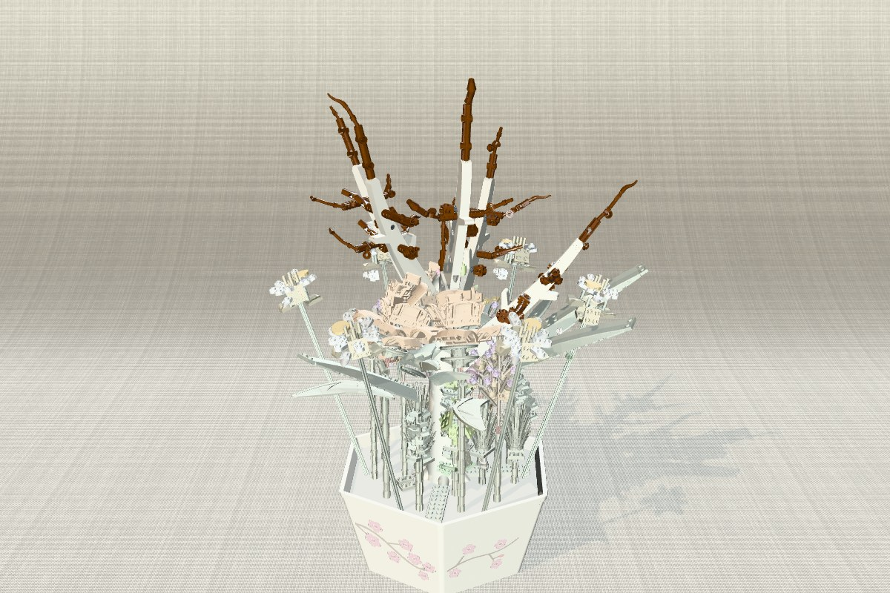

Push a grey 3L axle through each sideways cross hole in the branches and build a twig on both ends. Add twigs to the branch tips and the trunk top, then press half pins into the small round branch holes for the spur clusters.

- Four spur clusters only lock in place once their neighbouring blossoms go on in step 10; hold them with a finger meanwhile.

<details><summary>LEGO pieces for this step (161)</summary>

| Qty | Colour | Part | ID |
|---:|---|---|---|
| 24 | Reddish Brown | Plate, Round 1 x 1 with Open Stud | `85861` |
| 20 | Reddish Brown | Technic, Axle Connector 2L (Smooth with x Hole + Orientation) | `6538c` |
| 18 | Black | Technic, Axle 2L Notched | `32062` |
| 16 | Reddish Brown | Bar 2L with Stop Ring | `78258` |
| 14 | Reddish Brown | Brick, Modified 1 x 1 with Studs on 4 Sides | `4733` |
| 12 | Dark Bluish Gray | Technic, Pin 1/2 with Friction Ridges | `89678` |
| 12 | Reddish Brown | Technic, Axle and Pin Connector Angled #2 - 180 degrees | `32034` |
| 12 | Reddish Brown | Bar Holder with Handle | `23443` |
| 12 | Reddish Brown | Bar 1L with Clip Mechanical Claw - Cut Edges and Hole on Side | `48729b` |
| 9 | Light Bluish Gray | Technic, Axle 3L | `4519` |
| 4 | Reddish Brown | Technic, Axle Connector Hub with 2 Bar Holders Perpendicular | `24122` |
| 4 | Reddish Brown | Cattle Horn, Long | `13564` |
| 2 | Reddish Brown | Plant Stem with Bar | `33183` |
| 2 | Reddish Brown | Cone 1 x 1 with Top Groove | `4589b` |

</details>

### Step 10. Blossoms

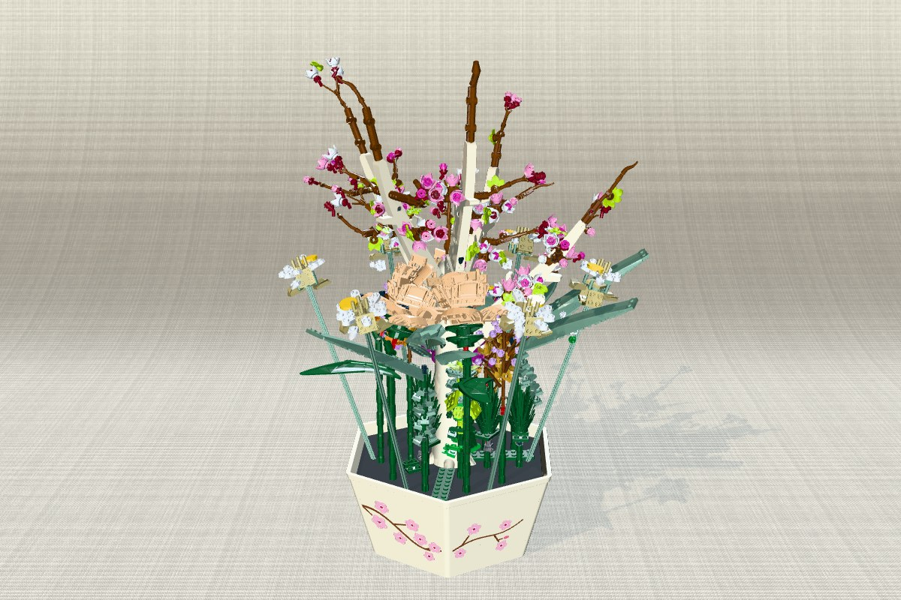

Finish the canopy: blossom sprays on the twig ends, then crowns with flower centres, small flowers, swirl buds and lime leaves.

- Turn the planter as you go and look at it from a few steps away: the canopy reads best with gaps between the clusters.

<details><summary>LEGO pieces for this step (278)</summary>

| Qty | Colour | Part | ID |
|---:|---|---|---|
| 44 | Dark Red | Bar 1L with Angled Hollow Stud | `65578` |
| 37 | White | Minifigure, Headgear Crown Eggshell with 5 Points and Center Stud | `39262` |
| 37 | Dark Pink | Plate, Round 1 x 1 with Flower Edge (5 Petals) | `24866` |
| 37 | Bright Pink | Minifigure, Headgear Crown Eggshell with 5 Points and Center Stud | `39262` |
| 37 | Bright Pink | Plate, Round 1 x 1 with Flower Edge (5 Petals) | `24866` |
| 32 | Lime | Plant Plate, Round 1 x 1 with 3 Layered Leaves | `32607` |
| 26 | Dark Red | Plate, Round 1 x 1 with Flower Edge (5 Petals) | `24866` |
| 12 | Reddish Brown | Plant Flower Stem with Bar and 3 Stems Short | `68211` |
| 6 | White | Plate, Round 1 x 1 with Vertical Swirl / Twist | `15470` |
| 6 | Bright Pink | Plate, Round 1 x 1 with Vertical Swirl / Twist | `15470` |
| 4 | Reddish Brown | Plant Flower Stem with Bar Holder, Bar, and 3 Stems | `24855` |

</details>


<a id="design-notes"></a>
## Design notes

### Why a hexagon
Six-fold symmetry matches what goes in the planter: six leaning daisy axles, six feet, and the stems in two rings. A hexagon also fits the CORE One bed upright with room to spare: 227 mm across corners along the 250 mm axis and 198 mm across flats on the 220 mm axis. With a 13.6° draft, filleted corners and a 1.2 mm rim band, it reads as a planter rather than a box.

### What each material does
- **Bone PLA** for everything that has to be stiff and hold LEGO holes to size: planter, soil core, trunk, branches. The off-white leaves the colour to the flowers and the paint.
- **Black TPU** for the soil mat: it looks like soil, and its springy cross pegs grip the stem connectors firmly without cracking.
- **Clear TPU** for non-slip feet that won't scratch furniture, and for sleeves that grip each 3L pin's stop bush, so a branch holds its angle and can be taken off and put back without wearing the PLA.

### Structure
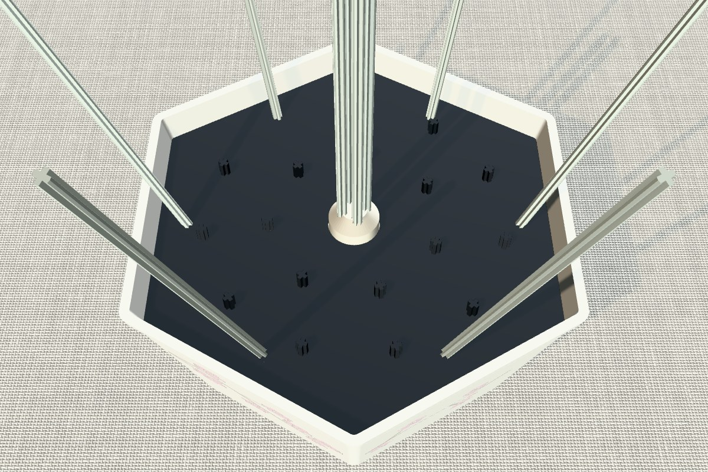

- **Planter:** 3.2 mm walls, 3 mm floor. Four cross pegs in the centre and six on 18° bosses take 3L connectors; a 4 mm ledge carries the soil; six 14 mm pockets underneath take the feet.
- **Soil core and mat:** 6.4 mm of PLA plus 1.6 mm of TPU, 0.5 mm clear of the walls. Ten cross pass-throughs for the 32L axles go through both; 17 TPU pegs for the stems; a PLA boss in the middle for the trunk.
- **Trunk:** 200 mm, tapering from r 20 to r 12 mm, with flared roots. Four channels take the centre axles up to 192 mm, which pins the trunk to the planter floor. Five stubs rise at 30–48°.
- **Branches:** 9 mm thick, 117–155 mm long, printed flat. A pin hole and a cross hole at the root, sideways cross holes for the twig axles, small pin holes for the spur clusters, and a tip hole.
- **Joint:** a 3L pin and a 2L axle per branch. The axle stops the branch twisting; the pin's bush sits in the clear sleeve.
<br clear="right">

### Keyed, numbered branch joints
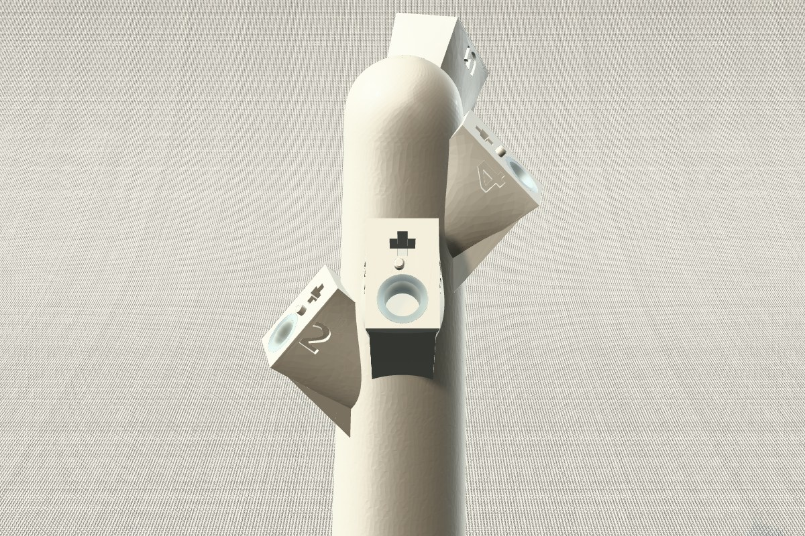

Each stub face has a 2 mm key pin at its own offset across the face (stubs 1–5: 0, −1.2, +0.6, +1.8, −2.4 mm), and each branch root has the matching hole. Checked in CAD: every branch seats on its own stub with zero overlap, while every wrong stub, and every branch except branch 1 turned upside down, puts the key pin into solid PLA, so it won't sit flat. Branch 1's key is centred, so it fits either way up; since a branch is the same shape on both faces, that does no harm. Numbers are engraved on both sides of each stub and on each branch root.
<br clear="right">

### The sakura motif
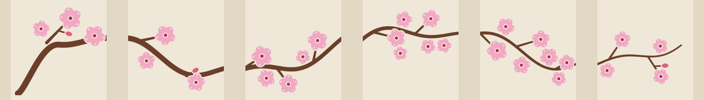

One branch wraps all six faces, generated by [`tools/make_motif.py`](tools/make_motif.py) (change the seed for a different branch). The rules that make it printable and paintable:

- Pockets are 0.8 mm deep, cut inward and downward at 45° so their top edges never form a ledge.
- Each colour has its own pockets: bark, petals, flower centres and buds. Every pocket is at least 1.1 mm wide, and pockets of different colours are separated by at least 0.9 mm of planter surface, so you can flood one colour and wipe the face clean.
- The motif stays 6 mm clear of each corner fillet; the branch "passes behind" the corners.

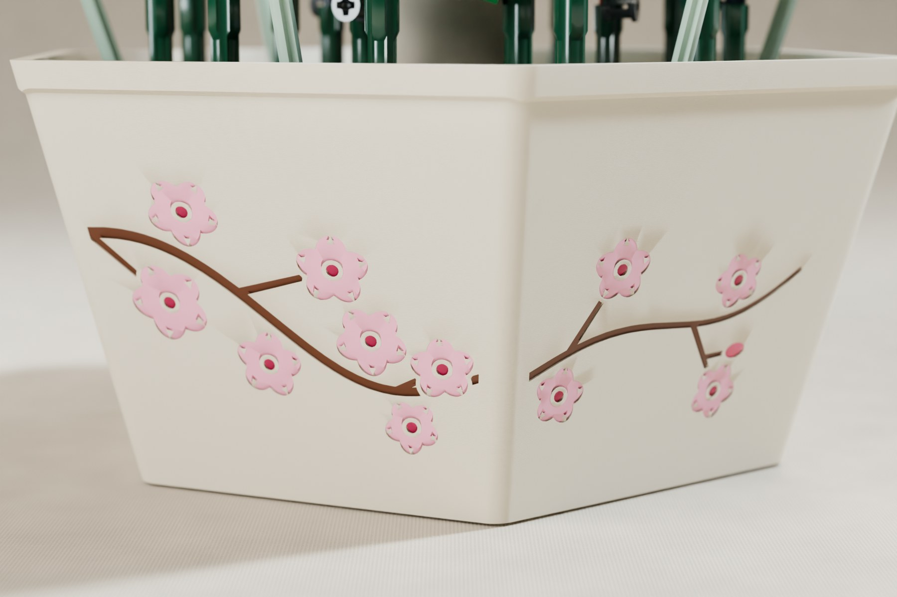

### Fits and tolerances
All values are aliases in the FreeCAD **Params** sheet.

| Parameter | Joint | Mates with | Value (mm) |
|---|---|---|---:|
| `peg_w × peg_t` | Floor cross peg (PLA) | into a 3L connector | 4.75 × 1.75 |
| `axle_w × axle_t` | Cross hole, vertical or angled (trunk channels, stubs, twig holes) | LEGO axle 4.8 × 1.8 | 5.0 × 2.0 |
| `pin_d` | Pin hole, vertical (branch spur holes) | Technic pin 4.8 | 4.9 |
| `hpin_d` | Pin hole, horizontal (branch roots) | Technic pin 4.8 | 4.95 |
| `haxle_w × haxle_t` | Cross hole, horizontal (branch roots and tips) | LEGO axle | 5.05 × 2.05 |
| `bar_d` | Bar hole (PLA; fit test only, for remixes) | LEGO bar 3.18 | 3.3 |
| `tpu_peg_w × tpu_peg_t` | Stem peg (black TPU) | into a 3L connector | 4.85 × 1.85 |
| `tpu_axle_w × tpu_axle_t` | Axle pass-through (black TPU) | 32L axle | 4.9 × 1.9 |
| `foot_d / foot_pocket_d` | Foot in its pocket | clear TPU into PLA | 14.3 / 14.0 |
| `sleeve_od / sleeve_pocket_d` | Sleeve in the stub | clear TPU into PLA | 9.7 / 9.6 |
| `sleeve_id` | Sleeve on the pin bush | stop bush ≈ 7.2 | 6.9 |
| `key_d / key_hole_d` | Branch key | PLA pin in PLA hole | 2.0 / 2.4 |
| `soil_gap` | Soil plate to planter wall | clearance | 0.5 |

Horizontal holes (branch roots and tips) have their own parameters because holes printed sideways come out smaller top-to-bottom than holes printed upright.

### How the build was checked
All 1,193 LEGO pieces were placed in 3D against the FreeCAD parts and checked by voxelising every piece at 0.4 mm: overlaps between parts, contact (does every part touch something that holds it?) and support step by step through the build.

- **0 floating pieces.**
- **76 overlaps of 4 mm³ or more**, almost all petals inside flower heads (snapdragons 25, roses 12, lavender 11, poppies 10). Real petals flex aside. Against printed parts: sand green blossom whorl (75937) against trunk (13 mm³); lime green tip buds (3062) against trunk (5 mm³); black branch joint pin (trunk to branch) (32054) against branch 4 (4 mm³). The snapdragon parts are the reason for the note in step 7; the branch-pin overlap is its friction ridges in the hole, as intended.
- **88 near-touches** (1.5–4 mm³), harmless.
- **Held only once a later step is done:** one lavender floret (steps 7–8) and four canopy spur nodes (step 9), all secured by step 10.
- **Stability:** the centre of mass is 2.9 mm off the trunk axis and the feet sit on a 71 mm radius.
- **Branch loads:** 44–59 g of canopy per branch, at most 40 N·mm at the joint. LEGO weight ≈ 788 g.

During the check the layout was changed so that bushes stand under the lowest branch, every rose sits on a bent stem, all stems keep 40 mm from the branches, lavender side stalks fan away from the trunk, and the ground-cover plates lie between the two stem rings.

### Limits
- The parts haven't been test-printed. The fit-test kit exists for that reason: run it first.
- The checks prove the shapes fit, not how hard every clip and bar joint grips.
- Petal positions are a modelled arrangement; fan them by eye.

<a id="changing-the-design"></a>
## Changing the design and rebuilding everything

```sh
pip install -r pipeline/requirements.txt
python tools/make_motif.py [seed]                     # 1. sakura artwork -> cad/motif.json, images/motif.svg
freecadcmd cad/build_sakura.FCMacro                    # 2. all parts -> cad/SakuraPlanter.FCStd, cad/out/ (or run it in the FreeCAD GUI)
python tools/make_plates.py PrusaResearch.ini          # 3. plates -> print/plates/*.3mf, print/stl/
python tools/slice_plates.py                           # 4. optional: slice for times and weights (needs prusa-slicer on PATH)
python pipeline/run_pipeline.py                        # 5. place and check the LEGO -> lego/, docs/data/viewer_data.js
python tools/build_docs_data.py                        # 6. step lists for the page -> docs/data/
python tools/make_readme.py                            # 7. this README
```

Fit values can be changed freely. Moving holes (trunk height, branch angles, pot size) moves where the LEGO goes, so rerun step 5 afterwards and check `lego/verify_report.json`. Step 5 downloads the LDraw parts it needs on first run and caches them in `pipeline/.ldcache/`.

Renders: `python tools/render/prep_render.py`, then `python tools/render/blender_hero.py out.png 2400 1600 64 hero` (needs the `bpy` module, Blender 4.2 or newer). The step images come from the assembly page in screenshot mode: `docs/index.html?shot=s5&w=1200&h=800`.

## The 3D assembly page

[`docs/index.html`](https://sawaiz.github.io/sakuraPlanter/) shows the model on a procedurally generated linen sweep, lit by a studio HDR. Every step animates its pieces into place, earlier steps fade back (switch that off with *Fade earlier*), and the side panel lists the exact pieces. Use the arrow keys or the blossoms along the bottom to move between steps, drag to turn, scroll to zoom, and double-click to reset the view. Links to a step work, for example `#s7`.

To publish it: **Settings ▸ Pages ▸ Deploy from a branch ▸ `main` / `docs`**. To preview it locally: `cd docs && python -m http.server`, then open http://localhost:8000.

## Credits and licences

- **Models, meshes, renders and documentation:** [CC BY-NC-SA 4.0](LICENSE-MODELS.txt). **Code** (macro, scripts, web page): [MIT](LICENSE).
- LEGO® is a trademark of the LEGO Group, which does not sponsor, authorise or endorse this project. You need the two retail sets; no LEGO parts are included here.
- LEGO part geometry comes from the [LDraw parts library](https://www.ldraw.org) (CC BY 2.0 / CCAL 2.0), via the [gkjohnson/ldraw-parts-library](https://github.com/gkjohnson/ldraw-parts-library) mirror.
- Studio HDR: *Studio Small 03* from [Poly Haven](https://polyhaven.com) (CC0), via [pmndrs/drei-assets](https://github.com/pmndrs/drei-assets).
- [three.js](https://threejs.org) r170 (MIT), vendored in `docs/vendor/`.
- Labels use DejaVu Sans Bold ([licence](cad/fonts/DejaVu-LICENSE.txt)). The web page uses Shippori Mincho B1 and Instrument Sans from Google Fonts (SIL Open Font License).
